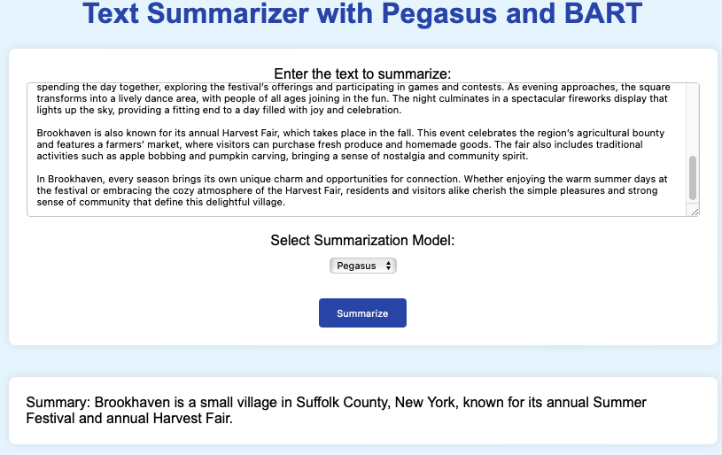

# Text Summarizer App with Pegasus and Bart

This repository contains the code for a simple text summarizer app that I made using Flask, FastAPI, and Streamlit.

The language models are based two open source models, [Google's Pegasus](https://huggingface.co/google/pegasus-xsum) and [Meta's BART](https://huggingface.co/facebook/bart-large-cnn).

Following is the example text used for summary.

>In the tranquil village of Brookhaven, nestled among rolling hills and lush meadows, life moves at a gentle pace. This small, picturesque community is known for its scenic beauty and strong sense of tradition, making it a popular destination for those seeking respite from the fast-paced modern world. Brookhaven’s charm lies in its well-preserved heritage, friendly residents, and the harmonious way in which nature and human life coexist.
>
>The heart of Brookhaven is its central square, a lively hub where the community gathers for various events and activities throughout the year. The square is surrounded by quaint shops and cafes, each with its own unique character. On any given day, you might find locals sipping coffee and exchanging stories, or children playing in the nearby park. The area is adorned with colorful flowers and neatly trimmed hedges, adding to the town’s welcoming atmosphere.
>
>One of the most anticipated events in Brookhaven is the Summer Festival, a celebration that brings together people from all walks of life. Held annually in July, the festival features an array of attractions, including local food stalls, live music performances, and craft booths showcasing handmade goods. The festival’s highlight is the grand parade, where residents dress in elaborate costumes and march through the streets, creating a vibrant and festive spectacle.
>
>The festival also offers various activities for children, such as face painting, balloon animals, and a mini petting zoo. Families enjoy spending the day together, exploring the festival’s offerings and participating in games and contests. As evening approaches, the square transforms into a lively dance area, with people of all ages joining in the fun. The night culminates in a spectacular fireworks display that lights up the sky, providing a fitting end to a day filled with joy and celebration.
>
>Brookhaven is also known for its annual Harvest Fair, which takes place in the fall. This event celebrates the region’s agricultural bounty and features a farmers’ market, where visitors can purchase fresh produce and homemade goods. The fair also includes traditional activities such as apple bobbing and pumpkin carving, bringing a sense of nostalgia and community spirit.
>
>In Brookhaven, every season brings its own unique charm and opportunities for connection. Whether enjoying the warm summer days at the festival or embracing the cozy atmosphere of the Harvest Fair, residents and visitors alike cherish the simple pleasures and strong sense of community that define this delightful village.

## Flask

This is a demo of the Flask version with Pegasus.

This is a demo of the Flask version with BART.

## FastAPI

This is a demo of the FastAPI version with Pegasus.

This is a demo of the FastAPI version with BART.

## Streamlit

This is a demo of the Streamlit version with Pegasus.

This is a demo of the Streamlit version with BART.

